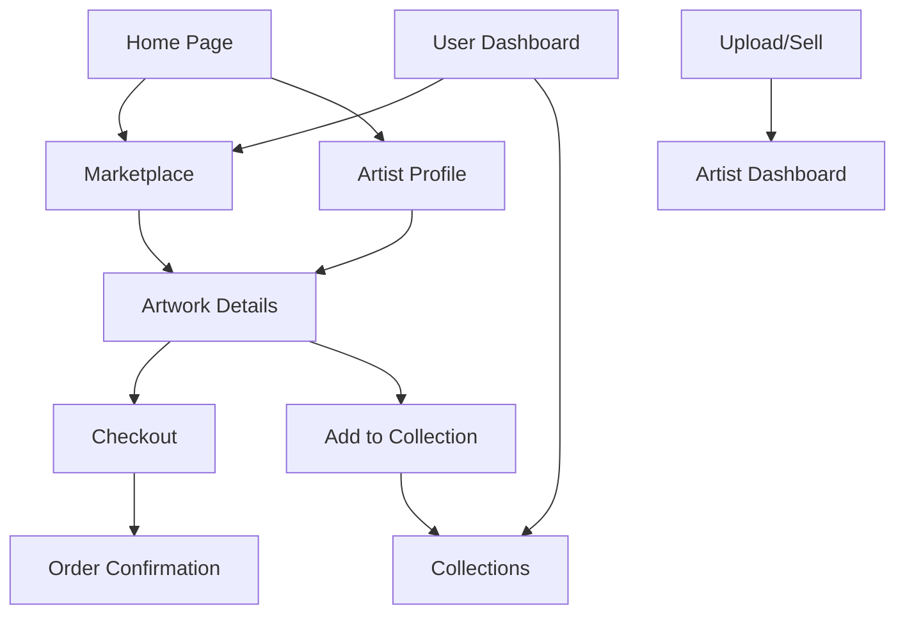

# ArtVault - Digital Art Marketplace MVP

## 1. Product Overview
ArtVault is a premium digital art marketplace that connects artists with collectors and art enthusiasts, enabling secure buying and selling of both digital and physical artwork. The platform provides a curated experience for discovering, purchasing, and trading unique art pieces with integrated payment processing and artist verification.

Target market: Art collectors, digital artists, galleries, and art investors seeking a professional platform for high-value art transactions with potential market value of $65B+ global art market.

## 2. Core Features

### 2.1 User Roles
| Role | Registration Method | Core Permissions |
|------|---------------------|------------------|
| Buyer | Email/social registration | Browse artwork, make purchases, create collections, follow artists |
| Artist | Application with portfolio review | Upload artwork, set pricing, manage sales, view analytics |
| Gallery Owner | Business verification process | Manage multiple artists, bulk uploads, commission tracking |
| Admin | Internal invitation only | Platform management, user verification, dispute resolution |

### 2.2 Feature Module
Our art marketplace consists of the following main pages:
1. **Home page**: hero gallery showcase, featured artists, trending artwork, category navigation
2. **Marketplace page**: artwork grid with filters, search functionality, sorting options
3. **Artwork details page**: high-resolution images, artist info, pricing, purchase options
4. **Artist profile page**: portfolio gallery, biography, social links, follow functionality
5. **User dashboard**: purchase history, collections, saved items, account settings
6. **Upload/sell page**: artwork submission form, pricing tools, metadata management
7. **Checkout page**: secure payment processing, shipping options, order confirmation

### 2.3 Page Details
| Page Name | Module Name | Feature description |
|-----------|-------------|---------------------|
| Home page | Hero Gallery | Display rotating featured artwork with smooth transitions and artist spotlights |
| Home page | Category Navigation | Browse by art type (digital, painting, photography, sculpture) with visual icons |
| Home page | Trending Section | Show popular and recently sold pieces with real-time updates |
| Marketplace | Search & Filter | Advanced filtering by price, medium, size, artist, style with instant results |
| Marketplace | Artwork Grid | Responsive masonry layout with lazy loading and hover previews |
| Marketplace | Sort Options | Sort by price, popularity, date added, artist name with saved preferences |
| Artwork Details | Image Viewer | High-resolution zoom, multiple angles, AR preview for physical pieces |
| Artwork Details | Purchase System | Add to cart, buy now, make offer functionality with secure processing |
| Artwork Details | Artist Info | Artist bio, other works, social links, follow/message options |
| Artist Profile | Portfolio Gallery | Organized artwork display with categories and chronological sorting |
| Artist Profile | Sales Analytics | Revenue tracking, popular pieces, audience insights (artist view only) |
| Artist Profile | Social Features | Follow count, reviews, social media integration, contact form |
| User Dashboard | Purchase History | Order tracking, download links for digital art, shipping updates |
| User Dashboard | Collections | Create custom collections, share publicly, organize favorites |
| User Dashboard | Account Settings | Profile management, payment methods, notification preferences |
| Upload/Sell | Artwork Submission | Multi-file upload, metadata forms, pricing calculator, preview mode |
| Upload/Sell | Pricing Tools | Market analysis, suggested pricing, commission calculator |
| Upload/Sell | Verification | Authenticity verification, copyright checks, quality review |
| Checkout | Payment Processing | Multiple payment methods, secure transactions, invoice generation |
| Checkout | Shipping Options | Digital delivery, physical shipping, insurance options |
| Checkout | Order Confirmation | Receipt generation, tracking info, download access |

## 3. Core Process

**Buyer Flow:**
Users discover artwork through browsing or search, view detailed artwork pages with high-resolution images and artist information, add items to cart or make direct purchases, complete secure checkout with multiple payment options, and receive digital downloads or shipping confirmation.

**Artist Flow:**
Artists apply for platform access with portfolio review, upload artwork with detailed metadata and pricing, manage their profile and portfolio presentation, track sales and analytics, receive payments through integrated system, and engage with buyers through messaging.

**Admin Flow:**
Admins review artist applications and artwork submissions, manage platform content and user verification, handle dispute resolution and customer support, monitor platform analytics and performance, and maintain security and compliance standards.

## 4. User Interface Design

### 4.1 Design Style
- **Primary Colors**: Deep charcoal (#2C2C2C) and pure white (#FFFFFF) for sophisticated contrast
- **Secondary Colors**: Gold accent (#D4AF37) for premium feel, soft gray (#F5F5F5) for backgrounds
- **Button Style**: Minimalist rounded corners (8px radius) with subtle shadows and hover animations
- **Typography**: Modern sans-serif (Inter) for headings, clean serif (Crimson Text) for artwork descriptions
- **Layout Style**: Clean grid-based design with generous white space, card-based artwork presentation
- **Icons**: Minimalist line icons with consistent stroke width, art-focused iconography

### 4.2 Page Design Overview
| Page Name | Module Name | UI Elements |
|-----------|-------------|-------------|
| Home page | Hero Gallery | Full-width carousel with fade transitions, overlay text in white/gold, minimal navigation |
| Home page | Category Navigation | Icon-based grid with hover effects, subtle shadows, consistent spacing |
| Marketplace | Artwork Grid | Masonry layout with consistent gaps, hover zoom effects, price overlays |
| Marketplace | Filter Sidebar | Collapsible panels, range sliders, checkbox groups with clean typography |
| Artwork Details | Image Viewer | Large centered image with thumbnail strip, zoom controls, fullscreen option |
| Artwork Details | Info Panel | Right sidebar with artist photo, pricing, description in structured layout |
| Artist Profile | Header Section | Cover image, profile photo, bio text, follow button, social links |
| Artist Profile | Portfolio Grid | Responsive grid with consistent aspect ratios, category tabs |
| User Dashboard | Navigation | Left sidebar with icon navigation, active state indicators |
| User Dashboard | Content Area | Card-based layout for orders, collections, settings panels |
| Upload/Sell | Form Layout | Multi-step wizard with progress indicator, drag-drop upload zones |
| Checkout | Payment Form | Secure form design with clear validation, payment method icons |

### 4.3 Responsiveness
Desktop-first design with mobile-adaptive breakpoints at 768px and 1024px. Touch-optimized interactions for mobile with larger tap targets, swipe gestures for image galleries, and simplified navigation. Progressive enhancement ensures core functionality works across all devices with enhanced features on larger screens.