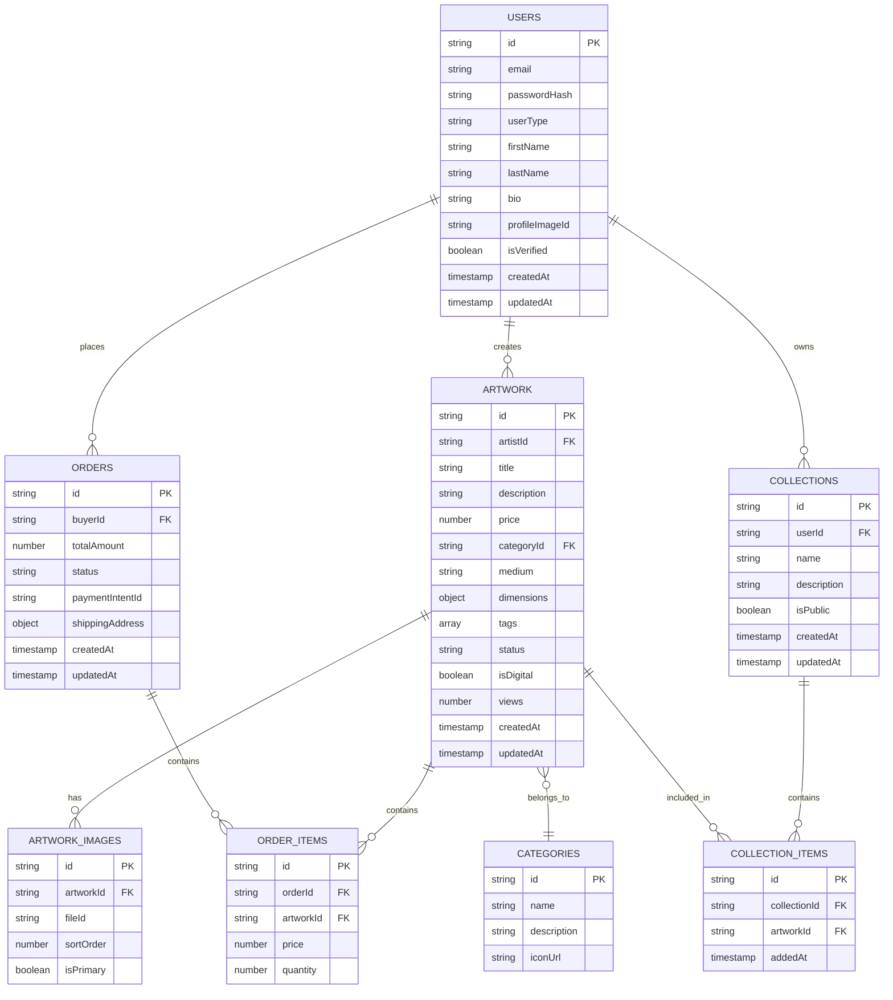

# ArtVault - Technical Architecture Document

## 1. Architecture Design


## 2. Technology Description

- **Frontend**: Next.js 14 + React 18 + TypeScript + Tailwind CSS + Framer Motion
- **Backend**: Convex (serverless functions + real-time database)
- **Database**: Convex (built-in PostgreSQL-compatible)
- **File Storage**: Convex File Storage for artwork images
- **Payment**: Stripe API integration
- **Image Processing**: Cloudinary for optimization and transformations
- **Authentication**: Convex Auth with social providers

## 3. Route Definitions

| Route | Purpose |
|-------|----------|
| / | Home page with featured artwork and hero gallery |
| /marketplace | Browse all artwork with search and filters |
| /artwork/[id] | Individual artwork details and purchase page |
| /artist/[id] | Artist profile with portfolio and bio |
| /dashboard | User dashboard for buyers (orders, collections) |
| /dashboard/artist | Artist dashboard for sellers (uploads, analytics) |
| /upload | Artwork upload and listing creation page |
| /checkout | Secure payment and order completion |
| /auth/signin | User authentication and registration |
| /collections/[id] | Public and private user collections |
| /search | Advanced search results page |

## 4. API Definitions

### 4.1 Core API

**Artwork Management**
```typescript
// Get all artwork with filters
api.query("artwork:list", {
  category?: string,
  priceMin?: number,
  priceMax?: number,
  artistId?: string,
  limit: number,
  offset: number
})
```

Request Parameters:
| Param Name | Param Type | isRequired | Description |
|------------|------------|------------|-------------|
| category | string | false | Filter by artwork category (digital, painting, etc.) |
| priceMin | number | false | Minimum price filter |
| priceMax | number | false | Maximum price filter |
| artistId | string | false | Filter by specific artist |
| limit | number | true | Number of items to return |
| offset | number | true | Pagination offset |

Response:
| Param Name | Param Type | Description |
|------------|------------|-------------|
| artworks | Artwork[] | Array of artwork objects |
| total | number | Total count for pagination |
| hasMore | boolean | Whether more items exist |

**User Authentication**
```typescript
// Create user account
api.mutation("auth:createUser", {
  email: string,
  password: string,
  userType: "buyer" | "artist" | "gallery",
  profile: UserProfile
})
```

**Purchase Processing**
```typescript
// Create purchase order
api.mutation("orders:create", {
  artworkId: string,
  paymentMethodId: string,
  shippingAddress?: Address
})
```

**Artist Operations**
```typescript
// Upload new artwork
api.mutation("artwork:create", {
  title: string,
  description: string,
  price: number,
  category: string,
  medium: string,
  dimensions: Dimensions,
  imageFiles: FileId[],
  tags: string[]
})
```

## 5. Server Architecture Diagram


## 6. Data Model

### 6.1 Data Model Definition



### 6.2 Data Definition Language

**Users Table**
```typescript
// Convex schema definition
export default defineSchema({
  users: defineTable({
    email: v.string(),
    passwordHash: v.string(),
    userType: v.union(v.literal("buyer"), v.literal("artist"), v.literal("gallery")),
    firstName: v.string(),
    lastName: v.string(),
    bio: v.optional(v.string()),
    profileImageId: v.optional(v.id("_storage")),
    isVerified: v.boolean(),
    stripeCustomerId: v.optional(v.string()),
    createdAt: v.number(),
    updatedAt: v.number(),
  })
  .index("by_email", ["email"])
  .index("by_user_type", ["userType"]),

  artwork: defineTable({
    artistId: v.id("users"),
    title: v.string(),
    description: v.string(),
    price: v.number(),
    categoryId: v.id("categories"),
    medium: v.string(),
    dimensions: v.object({
      width: v.number(),
      height: v.number(),
      depth: v.optional(v.number()),
      unit: v.string(),
    }),
    tags: v.array(v.string()),
    status: v.union(
      v.literal("draft"),
      v.literal("active"),
      v.literal("sold"),
      v.literal("archived")
    ),
    isDigital: v.boolean(),
    views: v.number(),
    createdAt: v.number(),
    updatedAt: v.number(),
  })
  .index("by_artist", ["artistId"])
  .index("by_category", ["categoryId"])
  .index("by_status", ["status"])
  .index("by_price", ["price"]),

  categories: defineTable({
    name: v.string(),
    description: v.string(),
    iconUrl: v.optional(v.string()),
  }),

  artworkImages: defineTable({
    artworkId: v.id("artwork"),
    fileId: v.id("_storage"),
    sortOrder: v.number(),
    isPrimary: v.boolean(),
  })
  .index("by_artwork", ["artworkId"]),

  orders: defineTable({
    buyerId: v.id("users"),
    totalAmount: v.number(),
    status: v.union(
      v.literal("pending"),
      v.literal("paid"),
      v.literal("shipped"),
      v.literal("delivered"),
      v.literal("cancelled")
    ),
    paymentIntentId: v.string(),
    shippingAddress: v.optional(v.object({
      street: v.string(),
      city: v.string(),
      state: v.string(),
      zipCode: v.string(),
      country: v.string(),
    })),
    createdAt: v.number(),
    updatedAt: v.number(),
  })
  .index("by_buyer", ["buyerId"])
  .index("by_status", ["status"]),

  orderItems: defineTable({
    orderId: v.id("orders"),
    artworkId: v.id("artwork"),
    price: v.number(),
    quantity: v.number(),
  })
  .index("by_order", ["orderId"]),

  collections: defineTable({
    userId: v.id("users"),
    name: v.string(),
    description: v.optional(v.string()),
    isPublic: v.boolean(),
    createdAt: v.number(),
    updatedAt: v.number(),
  })
  .index("by_user", ["userId"])
  .index("by_public", ["isPublic"]),

  collectionItems: defineTable({
    collectionId: v.id("collections"),
    artworkId: v.id("artwork"),
    addedAt: v.number(),
  })
  .index("by_collection", ["collectionId"]),
});
```

**Initial Data Setup**
```typescript
// Seed data for categories
const categories = [
  { name: "Digital Art", description: "Computer-generated and digital artwork" },
  { name: "Paintings", description: "Traditional and contemporary paintings" },
  { name: "Photography", description: "Fine art photography and prints" },
  { name: "Sculptures", description: "3D art and sculptural works" },
  { name: "Mixed Media", description: "Artwork combining multiple mediums" },
];

// Database permissions for Convex
// Authenticated users can read public artwork and create orders
// Artists can manage their own artwork
// Admins have full access to all tables
```